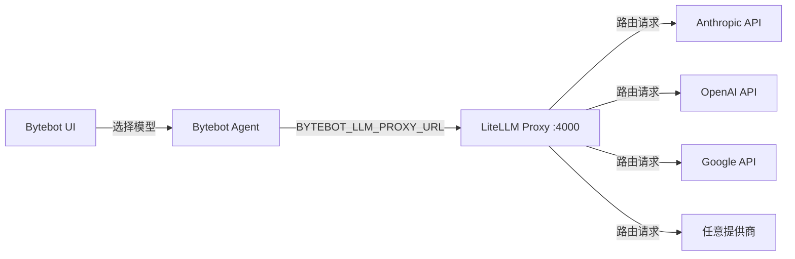

# 使用 LiteLLM 将任意 LLM 接入 Bytebot

LiteLLM 是统一代理，可让你在 Bytebot 中使用 100+ LLM 提供商——包括 Azure OpenAI、AWS Bedrock、Anthropic、Hugging Face、Ollama 等。本文介绍如何在 Bytebot 中启用 LiteLLM。

## 为什么使用 LiteLLM？

<CardGroup cols={2}>
  <Card title="支持 100+ 提供商" icon="plug">
    Azure、AWS、GCP、Anthropic、OpenAI、Cohere 以及本地模型
  </Card>
  <Card title="成本跟踪" icon="dollar-sign">
    在一个地方监控所有提供商的花费
  </Card>
  <Card title="负载均衡" icon="scale-balanced">
    跨模型与提供商分配请求
  </Card>
  <Card title="故障切换" icon="shield">
    主模型不可用时自动回退
  </Card>
</CardGroup>

## 使用 Bytebot 内置 LiteLLM 代理快速开始

Bytebot 包含预配置的 LiteLLM 代理服务，便于接入任意提供商。

<Steps>
  <Step title="使用带代理的 Docker Compose">
    推荐使用已启用代理的 Compose 文件：
    
    ```bash
    # 克隆 Bytebot
    git clone https://github.com/bytebot-ai/bytebot.git
    cd bytebot
    
    # 在 docker/.env 设置 API Key
    cat > docker/.env << EOF
    # 可添加任意组合的密钥
    ANTHROPIC_API_KEY=sk-ant-your-key-here
    OPENAI_API_KEY=sk-your-key-here  
    GEMINI_API_KEY=your-key-here
    EOF
    
    # 启动带 LiteLLM 代理的 Bytebot
    docker-compose -f docker/docker-compose.proxy.yml up -d
    ```
    
    这将自动：
    - 在 4000 端口启动 `bytebot-llm-proxy`
    - 通过 `BYTEBOT_LLM_PROXY_URL` 配置 agent 使用代理
    - 将已配置的模型通过代理统一暴露
  </Step>
  
  <Step title="自定义模型配置">
    如需添加自定义模型或提供商，编辑 LiteLLM 配置：
    
    ```yaml
    # packages/bytebot-llm-proxy/litellm-config.yaml
    model_list:
      # Azure OpenAI
      - model_name: azure-gpt-4o
        litellm_params:
          model: azure/gpt-4o-deployment
          api_base: https://your-resource.openai.azure.com/
          api_key: os.environ/AZURE_API_KEY
          api_version: "2024-02-15-preview"
      
      # AWS Bedrock
      - model_name: claude-bedrock
        litellm_params:
          model: bedrock/anthropic.claude-3-5-sonnet
          aws_region_name: us-east-1
      
      # 本地模型（Ollama）
      - model_name: local-llama
        litellm_params:
          model: ollama/llama3:70b
          api_base: http://host.docker.internal:11434
    ```
    
    然后重建：
    ```bash
    docker-compose -f docker/docker-compose.proxy.yml up -d --build
    ```
  </Step>
  
  <Step title="验证模型可用性">
    Bytebot Agent 会自动查询代理的可用模型：
    
    ```bash
    # 通过 Bytebot API 查看模型
    curl http://localhost:9991/tasks/models
    
    # 或直接从 LiteLLM 代理查看
    curl http://localhost:4000/model/info
    ```
    
    UI 的模型选择器中会显示所有可用模型。
  </Step>
</Steps>

## 工作原理

### 架构



### 关键组件

1. **bytebot-llm-proxy 服务**：在 Docker 中运行的 LiteLLM 实例，
   - 在 Bytebot 网络中占用 4000 端口
   - 使用 `packages/bytebot-llm-proxy/litellm-config.yaml` 作为配置
   - 从环境变量继承 API Key

2. **Agent 集成**：Bytebot Agent
   - 检查 `BYTEBOT_LLM_PROXY_URL` 环境变量
   - 若已设置，则查询代理 `/model/info` 获取可用模型
   - 将所有 LLM 请求通过代理转发

3. **预配置模型**：开箱支持
   - Anthropic：Claude Opus 4、Claude Sonnet 4
   - OpenAI：GPT-4.1、GPT-4o
   - Google：Gemini 2.5 Pro、Gemini 2.5 Flash

## 提供商配置示例

### Azure OpenAI

```yaml
model_list:
  - model_name: azure-gpt-4o
    litellm_params:
      model: azure/gpt-4o-deployment-name
      api_base: https://your-resource.openai.azure.com/
      api_key: your-azure-key
      api_version: "2024-02-15-preview"
  
  - model_name: azure-gpt-4o-vision
    litellm_params:
      model: azure/gpt-4o-deployment-name
      api_base: https://your-resource.openai.azure.com/
      api_key: your-azure-key
      api_version: "2024-02-15-preview"
      supports_vision: true
```

### AWS Bedrock

```yaml
model_list:
  - model_name: claude-bedrock
    litellm_params:
      model: bedrock/anthropic.claude-3-5-sonnet-20241022-v2:0
      aws_region_name: us-east-1
      # 从环境变量读取 AWS 凭证
  
  - model_name: llama-bedrock
    litellm_params:
      model: bedrock/meta.llama3-70b-instruct-v1:0
      aws_region_name: us-east-1
```

### Google Vertex AI

```yaml
model_list:
  - model_name: gemini-vertex
    litellm_params:
      model: vertex_ai/gemini-1.5-pro
      vertex_project: your-gcp-project
      vertex_location: us-central1
      # 从环境变量读取 GCP 凭证
```

### 本地模型（Ollama）

```yaml
model_list:
  - model_name: local-llama
    litellm_params:
      model: ollama/llama3:70b
      api_base: http://ollama:11434
  
  - model_name: local-mixtral
    litellm_params:
      model: ollama/mixtral:8x7b
      api_base: http://ollama:11434
```

### Hugging Face

```yaml
model_list:
  - model_name: hf-llama
    litellm_params:
      model: huggingface/meta-llama/Llama-3-70b-chat-hf
      api_key: hf_your_token
```

## 高级特性

### 负载均衡

在多个提供商之间分配请求：

```yaml
model_list:
  - model_name: gpt-4o
    litellm_params:
      model: gpt-4o
      api_key: sk-openai-key
  
  - model_name: gpt-4o  # 相同名称用于负载均衡
    litellm_params:
      model: azure/gpt-4o
      api_base: https://azure.openai.azure.com/
      api_key: azure-key

router_settings:
  routing_strategy: "least-busy"  # 或 "round-robin", "latency-based"
```

### 故障切换

配置自动回退：

```yaml
model_list:
  - model_name: primary-model
    litellm_params:
      model: claude-3-5-sonnet-20241022
      api_key: sk-ant-key
  
  - model_name: fallback-model
    litellm_params:
      model: gpt-4o
      api_key: sk-openai-key
```